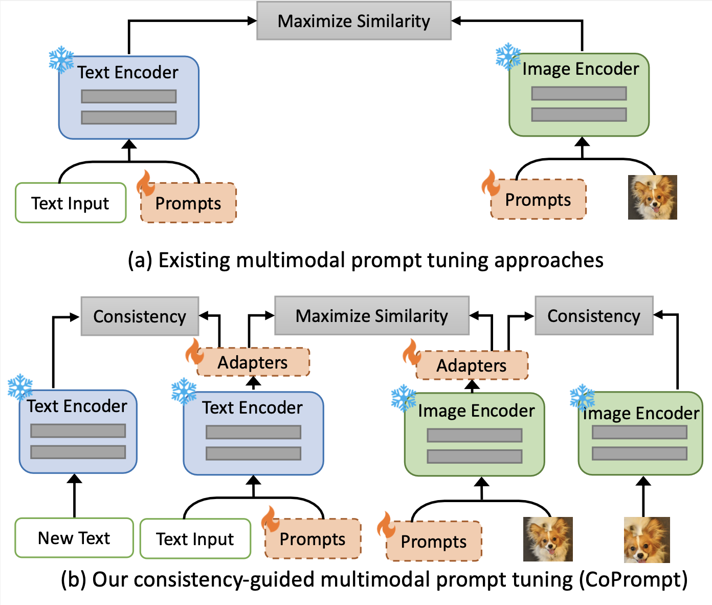

# CoPrompt

Official implementation of our ICLR 2024 paper:

> [**Consistency-guided Prompt Learning for Vision-Language Models**](https://arxiv.org/abs/2306.01195)
> Shuvendu Roy, Ali Etemad
> \*In Proceedings of the International Conference on Learning Representation (ICLR 2024)

[](https://arxiv.org/pdf/2306.01195.pdf)

<hr />

Base-to-novel generalization:

[](https://paperswithcode.com/sota/prompt-engineering-on-eurosat?p=consistency-guided-prompt-learning-for-vision)
[](https://paperswithcode.com/sota/prompt-engineering-on-dtd?p=consistency-guided-prompt-learning-for-vision)
[](https://paperswithcode.com/sota/prompt-engineering-on-food-101?p=consistency-guided-prompt-learning-for-vision)
[](https://paperswithcode.com/sota/prompt-engineering-on-oxford-iiit-pet-dataset?p=consistency-guided-prompt-learning-for-vision)
[](https://paperswithcode.com/sota/prompt-engineering-on-sun397?p=consistency-guided-prompt-learning-for-vision)
[](https://paperswithcode.com/sota/prompt-engineering-on-caltech-101?p=consistency-guided-prompt-learning-for-vision)
[](https://paperswithcode.com/sota/prompt-engineering-on-imagenet?p=consistency-guided-prompt-learning-for-vision)
[](https://paperswithcode.com/sota/prompt-engineering-on-stanford-cars-1?p=consistency-guided-prompt-learning-for-vision)
[](https://paperswithcode.com/sota/prompt-engineering-on-ucf101?p=consistency-guided-prompt-learning-for-vision)
[](https://paperswithcode.com/sota/prompt-engineering-on-fgvc-aircraft?p=consistency-guided-prompt-learning-for-vision)
[](https://paperswithcode.com/sota/prompt-engineering-on-oxford-102-flower?p=consistency-guided-prompt-learning-for-vision)

Domain Generalization:

[](https://paperswithcode.com/sota/prompt-engineering-on-imagenet-r?p=consistency-guided-prompt-learning-for-vision)
[](https://paperswithcode.com/sota/prompt-engineering-on-imagenet-s?p=consistency-guided-prompt-learning-for-vision)
[](https://paperswithcode.com/sota/prompt-engineering-on-imagenet-a?p=consistency-guided-prompt-learning-for-vision)

<hr />

<p align="center">
  
</p>

## Installation

```bash
# Installation borrowed from https://github.com/muzairkhattak/multimodal-prompt-learning
# Create a conda environment
conda create -y -n coprompt python=3.8

# Activate the environment
conda activate coprompt

# Install torch (requires version >= 1.8.1) and torchvision
# Please refer to https://pytorch.org/ if you need a different cuda version
pip install torch==1.9.0+cu111 torchvision==0.10.0+cu111 torchaudio==0.9.0 -f https://download.pytorch.org/whl/torch_stable.html


# Clone this repo
git clone https://github.com/KaiyangZhou/Dassl.pytorch.git
cd Dassl.pytorch/

# Install dependencies
pip install -r requirements.txt

# Install this library (no need to re-build if the source code is modified)
python setup.py develop
cd ..

# Clone CoPrompt code base
git clone https://github.com/ShuvenduRoy/CoPrompt

cd CoPrompt
# Install requirements

pip install -r requirements.txt

# Update setuptools package
pip install setuptools==59.5.0

```

## Dataset

Please follow the [CoOp](https://github.com/KaiyangZhou/CoOp/blob/main/DATASETS.md) repo to prepare the datasets. Set your data directory in the `scripts/base2new_train_coprompt.sh` and `scripts/base2new_train_coprompt.sh` file.

## Running the experiments

```bash
exp_name=CoPrompt
trainer=CoPrompt
train_bash=scripts/base2new_train_coprompt.sh
test_bash=scripts/base2new_test_coprompt.sh

export PYTHONPATH="$PYTHONPATH:$PWD"


for seed in 1 2 3
do
  bash $train_bash fgvc_aircraft $seed $exp_name
  bash $test_bash fgvc_aircraft $seed $exp_name  8

  bash $train_bash dtd $seed $exp_name
  bash $test_bash dtd $seed $exp_name  8

  bash $train_bash ucf101 $seed $exp_name
  bash $test_bash ucf101 $seed $exp_name  8

  bash $train_bash eurosat $seed $exp_name
  bash $test_bash eurosat $seed $exp_name  8

  bash $train_bash caltech101 $seed $exp_name
  bash $test_bash caltech101 $seed $exp_name  8

  bash $train_bash oxford_pets $seed $exp_name
  bash $test_bash oxford_pets $seed $exp_name  8

  bash $train_bash stanford_cars $seed $exp_name
  bash $test_bash stanford_cars $seed $exp_name  8

  bash $train_bash oxford_flowers $seed $exp_name
  bash $test_bash oxford_flowers $seed $exp_name  8

  bash $train_bash food101 $seed $exp_name
  bash $test_bash food101 $seed $exp_name  5

  bash $train_bash sun397 $seed $exp_name
  bash $test_bash sun397 $seed $exp_name  8

  bash $train_bash imagenet $seed $exp_name
  bash $test_bash imagenet $seed $exp_name  8
done
```

## Results

### CoPrompt in comparison with existing methods

Results reported below show accuracy for base and novel classes for across 11 recognition datasets averaged over 3 seeds.

| Name                                                                                                                                                                    | Base Acc. | Novel Acc. |    HM     |
| ----------------------------------------------------------------------------------------------------------------------------------------------------------------------- | :-------: | :--------: | :-------: |
| [CLIP](https://arxiv.org/abs/2103.00020)                                                                                                                                |   69.34   |   74.22    |   71.70   |
| [CoOp](https://arxiv.org/abs/2109.01134)                                                                                                                                |   82.69   |   63.22    |   71.66   |
| [CoCoOp](https://arxiv.org/abs/2203.05557)                                                                                                                              |   80.47   |   71.69    |   75.83   |
| [MaPLe](https://arxiv.org/abs/2210.03117)                                                                                                                               |   82.28   |   75.14    |   78.55   |
| [PromptSRC](https://openaccess.thecvf.com/content/ICCV2023/papers/Khattak_Self-regulating_Prompts_Foundational_Model_Adaptation_without_Forgetting_ICCV_2023_paper.pdf) | **84.26** |   76.10    |   79.97   |
| [CoPrompt](https://arxiv.org/abs/2306.01195)                                                                                                                            |   84.00   | **77.23**  | **80.48** |

## Acknowledgements

Our code is based on [MaPLe](https://github.com/muzairkhattak/multimodal-prompt-learning) repository. We thank the authors for releasing their code. If you use our model and code, please consider citing these works as well.

## Contact

If you have any questions, please create an issue on this repository or contact at shuvendu.roy@queensu.ca.

## Citation

If you use our work, please consider citing:

```bibtex
@inproceedings{CoPrompt,
  title={Consistency-guided Prompt Learning for Vision-Language Models},
  author={Roy, Shuvendu and Etemad, Ali},
  booktitle=ICLR,
  year={2024}
}

```
